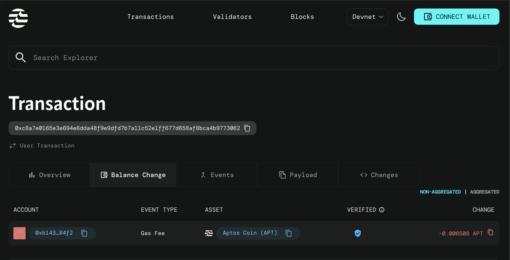

# APTOS_Practice

A small collection of Move language examples and experiments for learning Aptos/Move concepts.

## Overview

This repository contains short Move examples demonstrating basic language features: printing and strings, module visibility and `friend` access, looping constructs, error handling (`abort` / `assert!`), type casting, and simple on-chain modules (price feed + calculator).

## Prerequisites

- Install the Move toolchain or the Aptos CLI (the project uses a `Move.toml`).
- Basic familiarity with Move language and modules.

## Build & Test

- To build: `move build` (or use `aptos move build` if using the Aptos toolchain).
- To run unit tests: `move test` (or `aptos move test`).

## Deploy

- To deploy the modules to a network using the Aptos CLI:

	- Example command: `aptos move deploy --assume-yes --private-key-file <KEY_FILE> --profile devnet`

- Example output after a successful `aptos move deploy`:

```
Transaction submitted: https://explorer.aptoslabs.com/txn/0xc8a7e0165e3e694e6dda48f9e9dfd7b7a11c52e1ff677d658af8bca4b9773062?network=devnet
{
	"Result": {
		"transaction_hash": "0xc8a7e0165e3e694e6dda48f9e9dfd7b7a11c52e1ff677d658af8bca4b9773062",
		"gas_used": 6508,
		"gas_unit_price": 100,
		"sender": "b1434e5b30a2adc4ca05fb56877e86205e66b99277cfa849e531b687cc8f84f2",
		"sequence_number": 0,
		"replay_protector": {
			"SequenceNumber": 0
		},
		"success": true,
		"timestamp_us": 1766829002982356,
		"version": 463092225,
		"vm_status": "Executed successfully"
	}
}
```



## Sources

The `sources` folder contains short example modules used for learning and experimentation:

- `sample1.move` — Module `net2dev_addr::Sample1`.
	- Demonstrates printing values and strings, constructing `String` and `vector<u8>`, and a simple function `set_val()` returning a constant `Caps`.
	- Includes a test `test_set_val()` that calls `set_val()` and prints the result.

- `sample2.move` — Address `net2dev_addr` with modules `one`, `two`, and `three`.
	- Module `one` exposes a `public(friend)` function `get_val()` returning `100`.
	- Module `two` is declared as a `friend` and shows calling `one::get_val()` from `test_call_get_vall()`.
	- Module `three` contains commented code showing what happens when a module is not in the friend list.

- `sample3.move` — Module `net2dev_addr::Sample3`.
	- Demonstrates three loop constructs: `for`, `while`, and `loop` via `use_for_loop`, `use_while_loop`, and `use_loop`.
	- Each loop variant has a corresponding test printing its result.

- `sample4.move` — Module `net2dev_addr::Sample4`.
	- Demonstrates error handling: `use_abort` that aborts with code `101` and `use_assert` using `assert!(..., code)`.
	- Contains tests showing passing and failing cases; some tests are annotated with `#[expected_failure]` to illustrate test expectations.

- `sample5.move` — Address `net2dev_addr` with modules `PriceOracle` and `CastCheck`.
	- `PriceOracle::btc_price()` returns a `u128` price value.
	- `CastCheck::calculate_swap()` demonstrates casting from `u128` to `u64` and adding a fee, with a test `test_checkcast()`.


